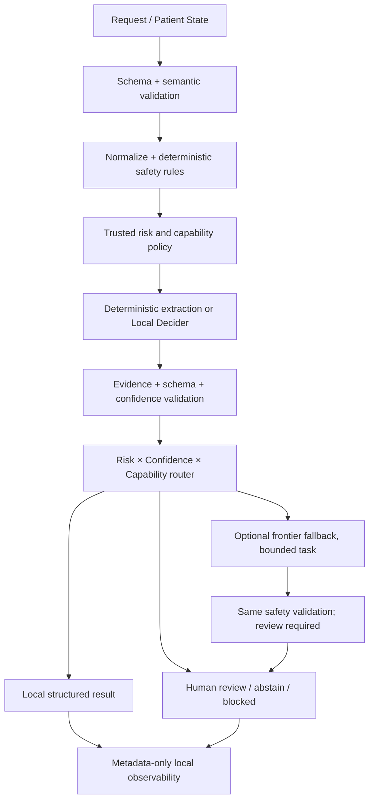

> Consolidated 2026-10-07: retained v0.1 requirements. Current GitHub implementation status and API migration are in docs/IMPLEMENTATION_STATUS.md and docs/API_MIGRATION.md. Historical local dev1/dev2 progress is not GitHub acceptance evidence.

# Technical specification v0.1

Spec revision 0.1.3 · Schema version 0.1.0 · Runtime target 0.1.0

GitHub implementation update (0.1.1.dev2): immutable wire models, request-scoped
normalization, finite grammar/preflight, rules/review envelope and local CLI are
ported. The library exposes canonical decide separately from advisory route.
The pure policy kernel uses str/Enum for Python 3.10 compatibility; its contexts
are internal trusted state, not HTTP requests. Provider/HTTP/frontier integration
and calibration remain pending. Historical local implementation notes below are
migration sources; current acceptance is docs/IMPLEMENTATION_STATUS.md.

## 1. Minimal architecture

Python 3.12、JSON Schema Draft 2020-12、stdlib core。dev1 使用 Schema-backed immutable models、stdlib loopback API 与 urllib Strands adapter；没有第二套手写 field schema。核心不依赖 Strands SDK、Torch、云 SDK；Strands server 单独部署和下载权重。

风险守门规则始终先运行，规则抽取命中不能直接跳过 safety。frontier 是补充结构化草稿，不是风险处理机构。高风险 / unknown risk 直接 human_review，可返回已获得的草稿，不必发送云端。

## 2. Data ownership

Patient State：request-scoped `state_id`、`revision`、`encounter_id`（均为不可逆随机引用）、文本 sources、结构化 facts 与 provenance。源文字和 facts 是未受信任数据，不是指令；fact 冲突保留，版本不得静默覆盖。facts 必须有 source span、assertion、temporality、subject；不把 unspecified 映射成 absent。

Agent Memory：只容纳项目约定、UI 偏好等非患者信息。公共 request 不接受 `memory`；不得把 Patient State、输出或 provider 对话存进 agent 长期记忆。v0.1 只定义隔离模型，不实现长期 memory。caller 管理真实 Patient State，库只读，输出为独立 derived artifact。

每个事实 / evidence 必须引用本次 state 的 source ID；offset 为 Unicode code point、左闭右开（不是 UTF-8 byte、不是 JS UTF-16），原文保持不变。不能凭模型新增事实；无证据输出 unknown 或复核。provider 给出的 evidence span 通过范围及内容语义校验；只合法 offset 不等于语义正确，benchmark 单独验证。

## 3. Trusted registry and effective risk

`configs/v0.1/tasks.json` 是 task definitions，客户端只选 task ID，不传 prompt、risk 或阈值。policy 从启动加载的配置选择，不接收任意路径 / URL。使用 SHA-256 固定配置内容，热改 / 请求内覆盖不在 v0.1。

风险序：low < moderate < high；unknown 独立表示不能确认安全，强制复核。effective risk 是任务风险与 preflight guard 的较高值；任一 unknown 则 review。所有请求都扫描所有 sources / facts，而非只检查请求的 task，以免只请求 laterality 绕过警示。冲突、患者主体不明、当前风险线索被否定处理不清等标记 review。

眼科工程 guard：当前明确的闪光 / 飞蚊、新变化、视力显著变化、遮挡描述等触发 needs_review；复杂否定、疑似风险或 subject 不明确触发 unknown risk。它们只是复核触发器，任何未命中都不能输出“安全”。guard 在本地，frontier 不允许撤销 review flag。最终请求风险与 route 由最严格 task / guard 聚合；不能通过多项任务平均置信度自动通过。

Capability 是部署端受信任 allowlist：固定 task IDs、language、question types、context limit、health、model revision、can_export / can_call_frontier。输入文本、model output、HTTP request 的自称均不能授予权限。v0.1 执行权限仅只读计算、返回结构化结果；没有 clinical write / treatment / notification capability。

## 4. Provider abstraction

协议入口见 `src/medsystem1/providers/base.py`。输入为规范化 state 和由 task registry 生成的固定问题；输出为 bounded labels / probabilities / native scores / evidence candidates / measured latency。provider 不接触 policy、router、工具执行或 Agent Memory。

`ProviderDescriptor`：provider_id、model_id、revision、supported_tasks、locality。health / 安装信息不能自动授予 capabilities。ProviderResult 必须逐题精确覆盖，无额外题、NaN、Infinity、未注册 label、负概率或概率和误差 >1e-5；异常视作 invalid output。

Strands v0.1 通过 `POST /v1/systemone` 接入，不使用它自己的 routing 建议。根据 [固定源码 schema.py](https://github.com/strands-labs/strands-decider/blob/890947e7ccd44c3de4115e26a7f46cc5c3147b44/src/strands_decider/schema.py)，上游有 choice / noul / score；choice 返回 label、distribution 与另行推导的 confidence，noul 返回 P(true)。v0.1 的多义文本任务用 choice，显式带 unknown / conflicting；不把二元 noul 硬塞给需要 unknown 的症状任务。missing_fields 用确定性 profile 比对。

native choice confidence 是归一化集中程度，不等于 top probability。保留原值，不冒称 domain calibration。真实 task correctness calibration 要使用本项目 held-out labels。生成模型的自述 confidence 不进入自动阈值，只能作为不可用分数；frontier 默认永远 review。

上游 [serving 文档](https://github.com/strands-labs/strands-decider/blob/890947e7ccd44c3de4115e26a7f46cc5c3147b44/docs/inference.md) 指明 loopback 默认、无鉴权、默认可能裁切输入；同时基座 loader 未自动使用 provenance revision。部署必须启用 `--strict-window`、一次只允许一条请求、固定 adapter 和基座快照。拒绝静默截断，不能只靠字符数保证 token window；超限 HTTP 422 转 review。server 外部不暴露，revision 由本地已核验 deployment manifest 提供，不相信 response model 名称即固定版本。

最初只实现 Strands + 单一 generic frontier HTTP contract；Laya / 生成本地模型只用 protocol 说明扩展点，不建立空 adapter 或虚假 capability。

## 5. Routing precedence (first matching guard wins)

| Priority | Condition | Route / outcome |
|---|---|---|
| 0 | Schema invalid / task unsupported / scope violation | HTTP 422；不调用 provider。无法归类的自由文本作为数据，不执行其中指令 |
| 1 | Execution capability forbidden / explicit forbidden action | blocked；不 export，不诊疗 |
| 2 | effective risk high / moderate / unknown，或 review lock | human_review；不受 confidence 影响 |
| 3 | conflict、截断、invalid output、out-of-domain | human_review；不通过 frontier 修复权限或语义风险 |
| 4 | low risk + trusted deterministic result + task capability + evidence valid | rules；completed、只返回结构化结果，不设置模型 confidence=1 |
| 5 | low risk + local task capability + calibrated eligibility + p≥task threshold + valid evidence | local_auto；completed、只返回结构化结果 |
| 6 | low risk，合法 uncertain output / timeout / local capability missing + all export gates | frontier_fallback；一次补充草稿，post-validate 后 human_review 或 abstained |
| 7 | 其他情况 | human_review；若没有任何可用结果且没有 review requirement 则 abstained |

这里的 `rules` / `local_auto` 表示结构化计算完成，不执行写入。urgency_to_review 基础风险 moderate，始终 review。default auto disabled，0.95 是 benchmark 待确认候选阈值，不是已校准医学门槛。低分可直接人工复核，云回退不是必经路径。

纯函数 `routing.py` 实现优先级 1–7 的 decision kernel。其输入只能由受信任 core 构造，不能直接接收 HTTP payload。dev1 的 rules_engine 已贯通规则模式；完整 local / frontier provider 编排尚未完成，kernel 通过不代表整个 system 安全。

## Implemented rule grammar (dev1)

只有 full-match 的中文子句可贡献已支持事实；主体在每个 source 内继承，遇到患者 / 家属等明确角色时切换，不跨 source 继承。过去 / 既往 / 曾有等表述单独处理，只有当前患者观察进入输出。数值时间支持有限中文整数和数字 / 半，以及小时、天、周、月、年；7 天是工程边界，月/年换算仅用于该标签。

未知句式 / 不清楚主体 / 不确定症状 / 矛盾 facts / 非中文 / 空白输入均锁定 review。症状 present、明显近期变化等工程线索锁定 high review。未提症状为 unknown，有明确否定才是 absent；没有疾病推断或“safe”标签。urgency hint 在明确当前线索或事实冲突时 needs_review；只有范围不确定时 value=unknown，但 review_required 仍为 true。

结构化 facts 只在与原文规则观察、主体、时态、assertion、完整来源子句覆盖一致时认可；不能覆盖 source。规则未知值可引用检查过的完整 context，明确值引用子句 span。Unicode code point offsets 不受空格、emoji、全角标点影响。语义不覆盖的医学表达属于 review-only，不能声称 parser 对任意病历完整。

## 6. Calibration and acceptance

校准不是训练模型。每个 task / provider / model+base revision / prompt version / language / domain / label set / preprocessing version 有独立 artifact；只在 dev/calibration split 拟合，test split 只评估。identity calibration 也须在域内验证。输入分布偏离、artifact 缺失 / 不匹配或样本数不足时 calibrated_probability=null、auto 禁用。

门槛选择是 coverage vs error 的工程决策，不用一个全局 0.95。confidence router 接收 per-item calibration，聚合用严格复核优先级。禁止概率均值、阈值附近重试到高分、frontier 自述 high confidence、跨语言套用 artifact。

## 7. Fallback, errors, budgets

默认 frontier disabled。运行管理员预先设置 enabled、endpoint / model allowlist、固定 credential env；调用者只能传 `cloud_fallback_requested`。还必须有 task export 能力、部署端可信隐私判定和允许发送的数据摘要（缺省禁止）。request 的 synthetic 标记不算 privacy clearance。识别到 PHI、隐私判断不可用、payload 越界：直接 review，零云请求。

初版只允许管理员登记的合成 fixtures 或经外部授权去标识化的摘要。不能假定正则脱敏充分。frontier 接收同样有限枚举，不发送病历全集、不运行 tool calls、不在 response 出现自由诊疗文本。Frontier结果是 draft，不能降风险或绕过 human review。

默认 local timeout 2000ms、frontier 10000ms、总预算 15000ms；这是候选工程配置，CPU 可用版本化 profile 覆盖，不能偷偷重试。max fallback calls=1，retry=0。deadline 以 monotonic clock 测量。partial 只返回可信 task drafts，缺项逐项 abstained；聚合 review，不使用缓存中的其他患者结果。

## 8. Observability and permissions

默认本地 metadata event：random request_id、task IDs、route、risk、reason codes、版本 / 配置 hash、latency、timeout、fallback used、review required。日志 allowlist；禁止 source text、facts、span 内容、Patient State ID、encounter ID、auth headers、provider raw payload。offset / evidence 只在正常响应，不进入 telemetry。

error message 返回固定 error code，不回显输入或 provider 原文。request_id 由服务生成或严格长度校验，不把日志字段当任意文本。观测输出失败时不扩大网络权限，标记 observability_degraded；v0.1 不执行临床 action。默认无远程 exporter、无外部 tracing 服务、无需全套 OpenTelemetry。

## 9. Versioning / source of truth

Schema + semantic validators + code behavior 是实现真源；文档冲突要作为 defect 修复，不能靠“文档优先”跳过安全边界。版本分别记录 schema=0.1.0、spec=0.1.0、policy、rules、prompt、software、provider+model+base、calibration。不可变版本 ID 加内容 hash。

新增 label / 字段 / 必填规则影响客户端：更新 Schema revision、fixtures、contracts、docs、CHANGELOG；不能原地改旧版本目录并仍保留旧 artifact ID。v0.1 内 breaking change 使用新 schema version（0.2.0）并明确 migration；纯措辞修订可升 spec patch。`additionalProperties=false` 杜绝 silent extension。
